# OpenChatBot

#### 介绍
微信机器人，机器人推送部分目前实现淘宝商品推送、定时任务、课表推送；另外支持企业微信机器人定时推送和ChatGPT的功能。微信机器人底层是openwechat——go结合C导出的动态库接口，C#+WPF做的接口交互和界面逻辑。

#### 软件架构
软件架构说明

#### 安装教程
下载完成，任选其一，点击安装即可。
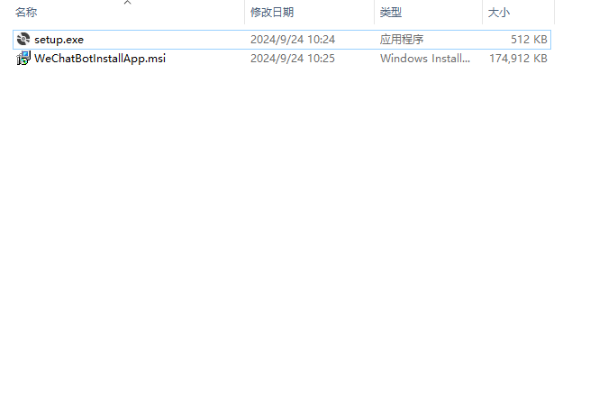

#### 使用说明

1.  安装完成，点击启动

2、启动初始界面，包含三大模块：微信机器人、企业微信机器人和ChatGpt
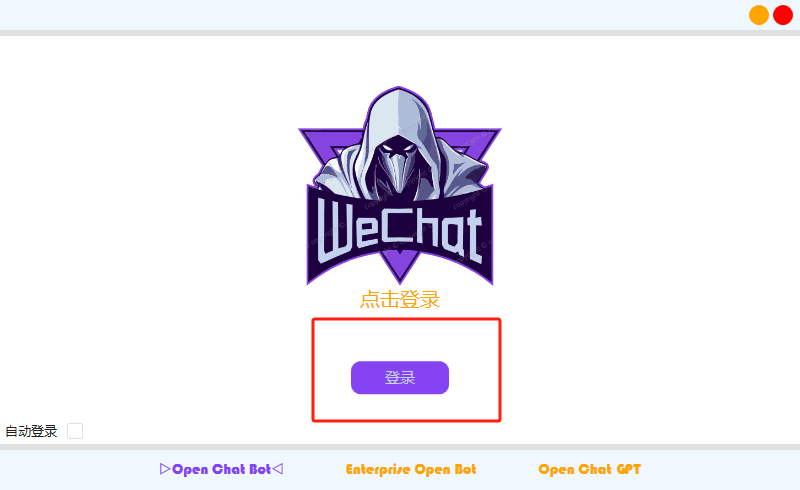
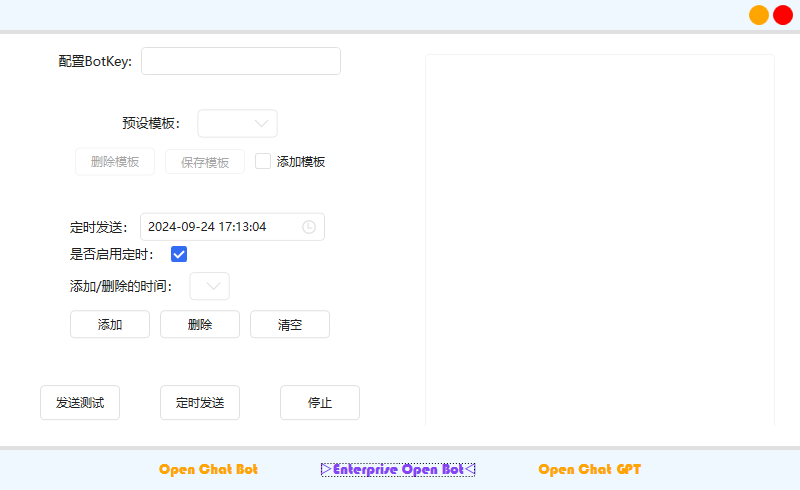
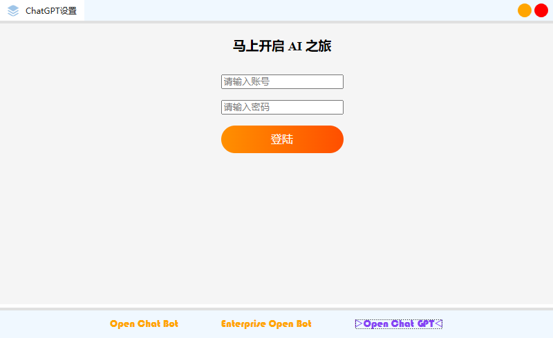
3、微信机器人模块
3.1机器人
（1）点击手机微信扫码登录即可
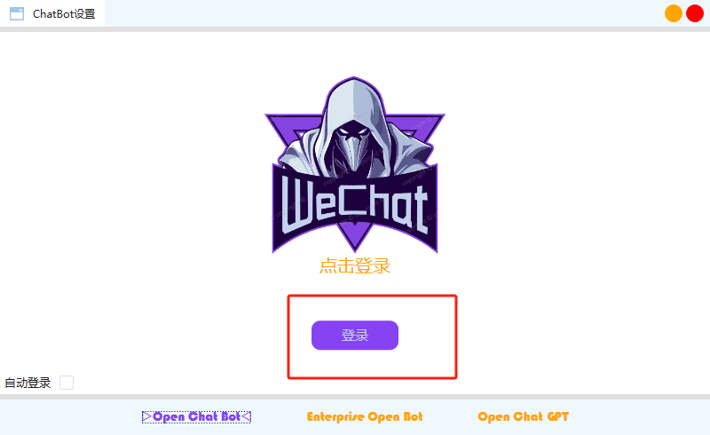
（2）登陆成功后，第一次登录有一个加载好友列别项的时间。
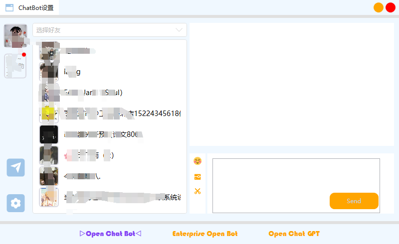
3.2推送模块
推送模块包含三部分：淘宝商单推送、定时任务推送和课表推送
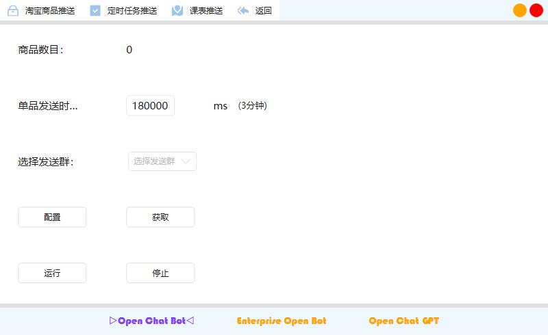
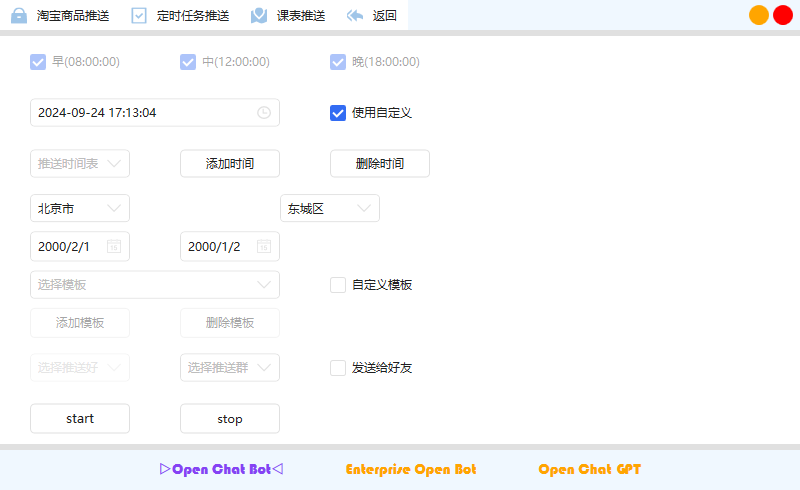
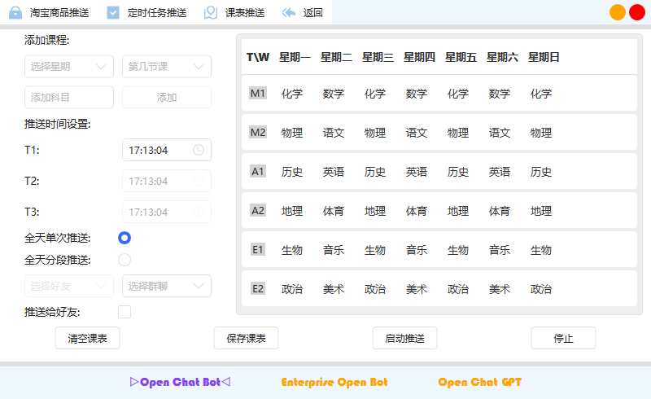

4、推送效果
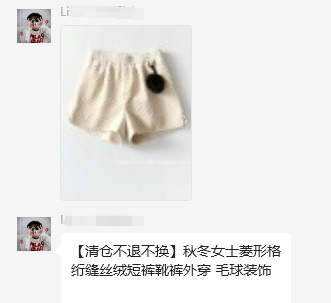
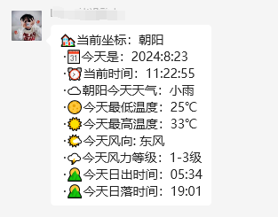
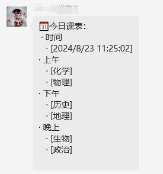

#### 参与贡献

1.  Fork 本仓库
2.  新建 Feat_xxx 分支
3.  提交代码
4.  新建 Pull Request

#### 特技

1.  使用 Readme\_XXX.md 来支持不同的语言，例如 Readme\_en.md, Readme\_zh.md
2.  Gitee 官方博客 [blog.gitee.com](https://blog.gitee.com)
3.  你可以 [https://gitee.com/explore](https://gitee.com/explore) 这个地址来了解 Gitee 上的优秀开源项目
4.  [GVP](https://gitee.com/gvp) 全称是 Gitee 最有价值开源项目，是综合评定出的优秀开源项目
5.  Gitee 官方提供的使用手册 [https://gitee.com/help](https://gitee.com/help)
6.  Gitee 封面人物是一档用来展示 Gitee 会员风采的栏目 [https://gitee.com/gitee-stars/](https://gitee.com/gitee-stars/)
